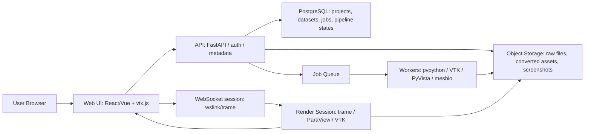

# ParaView類似Webアプリ自作に向けた調査メモ

作成日: 2026-07-09 (JST)  
対象: 解析結果、CAE/CFD/FEA/科学データの表示・分析を行うParaView類似Webアプリ  
調査方法: メインエージェントで一次情報を確認し、サブエージェント3本で「GitHub/OSS」「論文・技術資料」「実装設計/MVP」を並行調査した。

## 1. 結論

ParaView相当のWebアプリを自作する場合、ブラウザだけで全ファイル形式と全フィルタを処理する設計は避けるべきである。現実的な構成は、以下のハイブリッド方式になる。

- 小規模な`VTP`/`VTI`/表面メッシュ/点群は、ブラウザ側で`vtk.js`を使って直接描画する。
- 巨大データ、非構造格子、`CGNS`/`Exodus`/`EnSight`/`XDMF+HDF5`などの重い形式、等値面・流線・再サンプリングなどの重いフィルタは、サーバ側のParaView/VTK/PyVistaで処理する。
- 将来拡張として、ブラウザ内処理には`VTK.wasm`/`ITK-Wasm`、高性能描画にはWebGPUを検証する。
- 旧`ParaViewWeb`は設計思想の参考にはなるが、GitHub上でdeprecated/maintenance modeの扱いなので、新規実装基盤にはしない。

推奨する進め方は次の2段階。

1. **短期PoC**: `trame + trame-vtk + ParaView/VTK/PyVista`で、Python中心にParaView風のWeb UIとパイプラインを素早く作る。
2. **製品化アーキテクチャ**: `React/Vue + vtk.js`のフロントエンド、`FastAPI`等のAPI、`pvpython`/ParaView worker、オブジェクトストレージ、非同期ジョブ、必要時のtrame render sessionを分離する。

## 2. 推奨アーキテクチャ

### 2.1 モード分離

| モード | 使う技術 | 対象 | 長所 | 注意点 |
|---|---|---|---|---|
| ブラウザ直接描画 | `vtk.js` | 小規模`VTP`、`VTI`、表面、点群、OBJ/STL | サーバ負荷が低い。操作応答が速い。 | `VTK/C++`の全機能はない。大規模非構造格子には弱い。 |
| サーバ処理 + 画像転送 | `trame`、`trame-vtk`、ParaView/VTK | 巨大データ、非構造格子、重いフィルタ | ParaView/VTKの成熟したreader/filterを使える。 | GPU/CPUコスト、WebSocket、セッション管理が必要。 |
| サーバ処理 + geometry転送 | `trame-vtk`、`vtk.js` | サーバで抽出した軽量ジオメトリ | 描画はクライアントGPU、処理はサーバで分担できる。 | 初回転送が重い。データ量を制御する必要がある。 |
| ブラウザ内WASM処理 | `VTK.wasm`、`ITK-Wasm` | 特定reader/filter、画像処理、軽量解析 | サーバ依存を減らせる。C++資産を移植しやすい。 | bundleサイズ、起動時間、メモリ上限、JS/WASM境界コピーが課題。 |
| WebGPU/独自GPU処理 | `vtk.js WebGPU`、`luma.gl`、WebGPU | 大量点群、カスタムシェーダ、将来の高速化 | GPU computeや新しい描画パスの余地がある。 | まだブラウザ差・機能差があり、MVP依存は避ける。 |

## 3. 中核OSS候補

GitHubメタデータは2026-07-09時点で`gh api`により実測・確認した。starsや最終pushは変動するため、採用時に再確認する。当初「要確認」だったライセンスはLICENSE本文を直接確認して確定させた（後述の注記参照）。なおGitHub API上、archived=trueのリポジトリは1件もなかった（`paraviewweb`もarchivedではないが実質メンテ停止）。

| リポジトリ | 主な用途 | ライセンス | Stars | 最終push | 採用判断 |
|---|---|---:|---:|---:|---|
| [Kitware/vtk-js](https://github.com/Kitware/vtk-js) | Web向けVTK実装。WebGL/WebGPU、ImageData/PolyData、VTP/VTI/OBJ/STLなど | BSD-3-Clause | 1516 | 2026-07-09 | 中核レンダラ候補 |
| [Kitware/trame](https://github.com/Kitware/trame) | PythonだけでWeb UI、VTK/ParaView、Plotly等を統合 | Apache-2.0（LICENSE本文で確定） | 681 | 2026-07-07 | PoC/サーバ処理UIの最有力 |
| [Kitware/trame-vtk](https://github.com/Kitware/trame-vtk) | trame用VTK/ParaView viewer。remote/local rendering切替 | BSD-3-Clause | 32 | 2026-06-30 | trame採用時の標準部品 |
| [Kitware/wslink](https://github.com/Kitware/wslink) | Python/JS間のWebSocket RPC/pub-sub | BSD-3-Clause | 98 | 2026-07-06 | 独自通信設計でも理解必須 |
| [Kitware/paraviewweb](https://github.com/Kitware/paraviewweb) | 旧ParaViewWeb | BSD-3-Clause | 178 | 2023-04-17（約3年停止/maintenance mode） | 新規採用せず、設計参考のみ |
| [Kitware/VolView](https://github.com/Kitware/VolView) | DICOM/医用ボリュームWebビューア | Apache-2.0 | 286 | 2026-06-30 | ボリュームUI・ローカルファイル処理の参考 |
| [Kitware/glance](https://github.com/Kitware/glance) | `vtk.js`ベースの軽量Webビューア、ParaView scene export | BSD-3-Clause | 273 | 2024-09-17（更新停滞気味） | 静的ビューア/共有形式の参考 |
| [Kitware/vtk-wasm](https://github.com/Kitware/vtk-wasm) | VTKをWebAssemblyでJSから利用 | Apache-2.0 | 22 | 2026-07-07 | 将来拡張候補、MVP依存は慎重 |
| [InsightSoftwareConsortium/ITK-Wasm](https://github.com/InsightSoftwareConsortium/ITK-Wasm) | ITK/C++処理のWASM化、画像/空間処理 | Apache-2.0 | 232 | 2026-07-08 | 画像IO/前処理/独自WASMの候補 |
| [Kitware/itk-vtk-viewer](https://github.com/Kitware/itk-vtk-viewer) | ITK-Wasm + vtk.jsの2D/3D画像・メッシュviewer | BSD-3-Clause | 239 | 2025-02-27 | viewer component設計の参考 |
| [pyvista/pyvista](https://github.com/pyvista/pyvista) | Python VTK高水準API、メッシュ解析・可視化 | MIT | 3737 | 2026-07-09 | Python worker/PoCに有用 |
| [pyvista/trame-pyvista](https://github.com/pyvista/trame-pyvista) | PyVistaとtrameの連携 | MIT | 2 | 2026-07-07 | 実在確認。ただしStar 2件と極小、検証必須 |
| [visgl/deck.gl](https://github.com/visgl/deck.gl) | 大規模WebGL2/WebGPUデータ可視化 | MIT | 14301 | 2026-07-08 | 点群/地理空間/補助ビュー向け |
| [visgl/luma.gl](https://github.com/visgl/luma.gl) | 低レベルWebGPU/WebGL GPU toolkit | MIT（LICENSE本文で確定） | 2457 | 2026-07-06 | 独自描画・GPU compute向け |
| [visgl/loaders.gl](https://github.com/visgl/loaders.gl) | big data/3D/geospatial向けローダ | MIT（umbrella LICENSEで確定） | 842 | 2026-06-30 | glTF/3D Tiles/Arrow等の中間形式に有用 |
| [mrdoob/three.js](https://github.com/mrdoob/three.js) | 汎用3Dライブラリ | MIT | 113594 | 2026-07-09 | 汎用3D UIには有用。科学データモデルは自前になりやすい |
| [nschloe/meshio](https://github.com/nschloe/meshio) | 多形式メッシュI/O変換 | MIT | 2308 | 2024-07-23（更新停滞） | 前処理に有用。ただし形式固有情報欠落に注意 |
| [sandialabs/seacas](https://github.com/sandialabs/seacas) | Exodus系プリ/ポスト/変換ツール群 | BSD-3-Clause（NTESS版、LICENSE本文で確定） | 185 | 2026-07-08 | Exodus対応の補助に有用 |
| [tkarabela/ensight-reader](https://github.com/tkarabela/ensight-reader) | EnSight Gold pure Python reader | MIT | 10 | 2026-05-12 | EnSight変換補助。小規模なので検証必須 |
| [xeokit/xeokit-sdk](https://github.com/xeokit/xeokit-sdk) | BIM/AEC WebGL viewer | AGPL-3.0または商用（デュアル） | 911 | 2026-06-25 | 建築/土木CADには強いがAGPL制約が大きい |
| [sci-visus/OpenVisus](https://github.com/sci-visus/OpenVisus) | 大規模科学データ管理・可視化 | BSD-3-Clause（ViSUS版、LICENSE本文で確定） | 35 | 2026-04-24 | out-of-core/streaming設計の参考 |
| [seelabutk/tapestry](https://github.com/seelabutk/tapestry) | Scientific Visualization as a Microservice実装 | MIT | 35 | 2024-04-23（更新停滞） | マイクロサービス化の参考 |

> ライセンス確定メモ（2026-07-09、LICENSE本文で確認）: `trame`=Apache-2.0、`luma.gl`=MIT、`loaders.gl`=MIT（umbrella LICENSE）、`seacas`=BSD-3-Clause（NTESS版）、`OpenVisus`=BSD-3-Clause（ViSUS版）。`vtk-wasm`・`trame-pyvista`はいずれも実在をAPIで確認済み（前者Apache-2.0、後者MITだがStar 2件）。これで採用判断上のライセンス不確実性は解消した。

## 4. 主要技術の読み解き

### 4.1 vtk.js

公式ドキュメントでは、`vtk.js`は「Scientific Visualization on the Web」のためのレンダリングライブラリで、`VTK/C++`をES6で再実装（"a complete rewrite of VTK/C++ using plain JavaScript (ES6)"）したものと説明されている。WebGL（"+WebGPU soon"）を利用し、WebGPU対応も進められている。重要なのは、公式が`ImageData`と`PolyData`、パイプライン基盤、よく使うreader、デモ的な一部filterを中心と説明しており、`VTK/C++`の全フィルタを置き換える方針ではない（"We are not aiming for VTK.js to provide the same set of filters that is available in VTK/C++"）点である。

補足として、`vtk.js`は表面ポリゴン描画だけでなく、`ImageData`のGPUボリュームレンダリング（`vtkVolumeMapper`）も備える。医用・CFD等のボリューム可視化をブラウザ側で行える点はMVPでの差別化要素になり得る。ただしWebGPUバックエンドはまだ移行途上のため、当面はWebGL2前提で性能・機能を見積もる。

参考:
- [VTK.js Overview](https://kitware.github.io/vtk-js/docs/)
- [Kitware/vtk-js](https://github.com/Kitware/vtk-js)
- [VTK.js examples](https://kitware.github.io/vtk-js/examples/)

### 4.2 trame

`trame`はPythonだけでWebアプリを作り、VTK/ParaView、Vuetify、Plotly、deck.glなどを統合できる（ライセンスはApache-2.0で商用利用可）。ParaView風の解析アプリを素早く作るには最短ルートである。`trame-vtk`を使うと、サーバ側レンダリング画像を送る方式と、クライアント側`vtk.js`で描画する方式を切り替えられる。

具体的には`trame-vtk`は次のビュー部品を提供する（実装選定に直結するので区別しておく）。

- `VtkRemoteView`: サーバ側GPUで描画し、画像をクライアントへ転送。クライアント負荷は低いがサーバGPU/帯域が要る。
- `VtkLocalView`: サーバから軽量ジオメトリを送り、クライアント側`vtk.js`（WebGL）で描画。初回転送は重いが以降のインタラクションはクライアントGPUで軽い。
- `VtkRemoteLocalView`: 同一の`vtkRenderWindow`を共有し、上記2方式を実行時に動的切替。
- （将来）`trame-vtklocal`: VTK.wasmを使い、サーバ側で構築したVTKパイプラインをブラウザ内でローカル描画する新方式。後述の通り現状は発展途上（VTK 9.4以降が必要）。

参考:
- [Kitware/trame](https://github.com/Kitware/trame)
- [trame documentation](https://trame.readthedocs.io/)
- [trame ParaView tutorial](https://kitware.github.io/trame/guide/tutorial/paraview.html)
- [Kitware/trame-vtk](https://github.com/Kitware/trame-vtk)
- trame論文: `Trame: Platform Ubiquitous, Scalable Integration Framework for Visual Analytics`, DOI [10.1109/MCG.2025.3540264](https://doi.org/10.1109/MCG.2025.3540264)

### 4.3 ParaViewWeb

ParaViewWebは、重い3D可視化と処理をリモートサーバに任せ、ブラウザでは画像または小規模ジオメトリを扱う設計だった。アーキテクチャ思想は今でも有効だが、現行の新規実装では`trame`/`vtk.js`に寄せるべきである。

参考:
- [ParaViewWeb Architecture](https://kitware.github.io/paraviewweb/docs/architecture.html)
- [Kitware/paraviewweb](https://github.com/Kitware/paraviewweb)
- [ParaViewWeb paper PDF](https://www.mirlabs.org/ijcisim/regular_papers_2011/Paper98.pdf)

### 4.4 VTK.wasm / ITK-Wasm

`VTK.wasm`はC++ VTKをWebAssemblyとしてブラウザから利用する方向性で、`vtk.js`だけでは足りないVTK機能をWebへ持ち込む道を開く。ただし、VTK公式ドキュメント上は「a prototype infrastructure ... still under active development」と位置づけられており、安定サポートではなく**実験的・開発中の段階**である点に注意する。描画は現状WebGL2中心で、WebGPU実装は進行中。現時点ではbundleサイズ、起動時間、メモリ、ブラウザ互換性、JS/WASM間のデータコピーが課題になる。`trame-vtklocal`（VTK.wasmによるローカル描画widget、VTK 9.4以降）も公式に「still at its infancy」とされ、発展途上である。**「WASMは将来の本命だが現時点は実験段階、当面のローカル描画は`vtk.js`ベースの`VtkLocalView`が既定」**という時系列で捉えるのが正しい。

`ITK-Wasm`は画像/空間解析に強く、Web worker poolによる非同期処理や、ブラウザ、Node.js、Python、WASIでの再現性ある実行を狙っている。医用画像や画像フィルタ、独自C++処理のWASM化に有用である。

参考:
- [Kitware/vtk-wasm](https://github.com/Kitware/vtk-wasm)
- [Using WebAssembly - VTK docs](https://docs.vtk.org/en/latest/getting_started/using_webassembly.html)
- [Introducing WebAssembly support in VTK](https://www.kitware.com/introducing-webassembly-support-in-vtk/)
- [InsightSoftwareConsortium/ITK-Wasm](https://github.com/InsightSoftwareConsortium/ITK-Wasm)
- [ITK-Wasm documentation](https://wasm.itk.org/)
- ITK-Wasm論文: DOI [10.25080/TCFJ5130](https://proceedings.scipy.org/articles/TCFJ5130)

## 5. ファイル形式と読み込み方針

| 形式 | 方針 | 理由 |
|---|---|---|
| `.vtp` | ブラウザ直読候補 | PolyDataで`vtk.js`と相性が良い。 |
| `.vti` | ブラウザ直読候補 | ImageDataでスライス/ボリュームMVPに向く。 |
| `.vtk` legacy | 原則サーバ側 | 内容がPolyDataとは限らない。legacy形式の直読は用途限定。 |
| `.vtu` | サーバ側処理、必要なら表面抽出して`.vtp`化 | UnstructuredGridはメモリとトポロジが重い。 |
| `.pvd` | サーバ側で展開し、時系列リスト化 | VTK XML系コレクション/時系列メタ形式。 |
| `.xmf/.xdmf + .h5` | サーバ側のParaView/VTK reader | XMLメタデータとHDF5配列を組み合わせるため、ブラウザ直読は複雑。 |
| raw `.h5/.hdf5` | 原則スキーマ必須。中身探索のみブラウザ候補 | 汎用HDF5だけではメッシュ/属性意味が分からない。 |
| `.cgns` | サーバ側 | multiblock、distributed、file seriesなどがあり、ParaView readerが安全。 |
| Exodus `.e/.exo` | サーバ側 | ブロック、セット、時系列、point/cell/global変数の選択が必要。 |
| EnSight `.case` | サーバ側 | ASCII/binary、multiblock、時系列対応が必要。 |
| CSV | 表として読み、座標列指定で点群化 | `Table to Points`相当の変換UIが必要。 |
| glTF/3D Tiles/LAS/LAZ | 補助形式として検討 | `deck.gl`/`loaders.gl`/`three.js`で扱いやすいが、CAE属性と時系列は別設計が必要。 |

> 形式分類の注意: `.vtp`/`.vti`/`.vtu`/`.pvd`はVTKの**ネイティブ形式**（Legacy / XML / VTKHDF）であり、[VTK File Formats](https://docs.vtk.org/en/latest/vtk_file_formats/index.html)ページに正式定義がある。一方`CGNS`/`Exodus`/`EnSight`/`Xdmf`は**このネイティブ形式ページには載っておらず**、それぞれ独立したreaderモジュール（`vtkCGNSReader`、`vtkExodusIIReader`、`vtkEnSightReader`/`vtkEnSightGoldReader`、`vtkXdmf3Reader`等）で対応する外部/科学計算形式である。両者を同列に「VTK公式ファイル形式」と扱うと誤解を招くため、「ネイティブXML/HDF形式」と「readerでサポートされる外部形式」は区別して設計・ドキュメント化する。

参考:
- [VTK File Formats](https://docs.vtk.org/en/latest/vtk_file_formats/index.html)
- [VTK XML File Format](https://docs.vtk.org/en/latest/vtk_file_formats/vtkxml_file_format.html)
- [ParaView Basic Usage: supported file formats](https://docs.paraview.org/en/latest/Tutorials/SelfDirectedTutorial/basicUsage.html)
- [ParaView Understanding Data](https://docs.paraview.org/en/latest/UsersGuide/understandingData.html)
- [vtk.js HttpDataSetReader](https://kitware.github.io/vtk-js/api/IO_Core_HttpDataSetReader.html)
- [Glance readers](https://kitware.github.io/glance/doc/readers.html)

## 6. MVP機能

最初のMVPは、ParaViewの全機能ではなく、解析結果確認で頻度の高い機能に絞る。

### 6.1 データ管理

- プロジェクト作成
- ファイルアップロード
- 元ファイルのオブジェクトストレージ保存
- メタデータ抽出ジョブ
- dataset type、bounds、points/cells数、blocks、timesteps、point/cell/field arrays、range、component数の保存
- 変換成果物とスクリーンショットのキャッシュ

### 6.2 表示

- surface / wireframe / points
- scalar coloring
- colormap、range、opacity
- color legend
- block表示/非表示
- time slider
- カメラ保存/復元
- スクリーンショット

### 6.3 基本フィルタ

- Slice
- Clip
- Contour / Isosurface
- Threshold
- Cell Data to Point Data
- Resample
- Decimation

ParaViewではフィルタは入力と出力を持つパイプラインモジュールである。Web側も`reader -> filter -> representation`をグラフとして保存する設計がよい。

参考:
- [ParaView Filtering Data](https://docs.paraview.org/en/latest/UsersGuide/filteringData.html)
- [ParaView Displaying Data](https://docs.paraview.org/en/latest/UsersGuide/displayingData.html)
- [ParaView Saving Results](https://docs.paraview.org/en/latest/UsersGuide/savingResults.html)

## 7. API/データモデル案

### 7.1 主要エンティティ

| エンティティ | 内容 |
|---|---|
| `Project` | 所有者、権限、プロジェクト設定 |
| `Dataset` | 元ファイル、形式、サイズ、メタデータ、変換状態 |
| `ArrayInfo` | point/cell/field、名前、成分数、range、単位 |
| `TimeStep` | 時刻、関連ファイル、キャッシュキー |
| `Pipeline` | reader/filter/representationのDAG |
| `PipelineNode` | 種別、入力、パラメータ、出力artifact |
| `Representation` | 表示方法、色、opacity、block visibility |
| `Job` | ingestion、変換、filter、render、export |
| `Artifact` | 変換済み`VTP/VTI`、HTTP dataset、画像、動画 |
| `Session` | WebSocket/trame/ParaView render session |

### 7.2 API例

| API | 用途 |
|---|---|
| `POST /datasets` | アップロード登録、署名付きURL発行 |
| `GET /datasets/{id}/metadata` | メタデータ取得 |
| `POST /datasets/{id}/ingest` | メタデータ抽出ジョブ開始 |
| `POST /pipelines` | パイプライン作成 |
| `PATCH /pipelines/{id}` | フィルタ/表示設定更新 |
| `POST /jobs` | 変換・フィルタ・レンダリングジョブ |
| `GET /jobs/{id}` | 進捗、ログ、結果 |
| `POST /sessions` | render session作成 |
| `WS /sessions/{id}` | カメラ、選択、レンダリング更新 |
| `GET /artifacts/{id}` | 変換成果物配信 |

## 8. 性能・運用上の注意

### 8.1 ブラウザ制約

- `vtk.js`は科学可視化向けだが、`VTK/C++`全体の置き換えではない。
- 非構造格子は点座標、connectivity、cell type、属性配列が重く、ブラウザメモリを圧迫する。
- 多ビューでWebGL contextを増やしすぎない。可能なら共有render windowやcanvas管理を行う。
- 大容量配列はJSONに埋めず、binary artifactとして配信する。
- 表示停止時に高品質化、操作中は低解像度/低LODにするprogressive UXが重要。

### 8.2 サーバ制約

- trame/ParaViewのinteractive sessionは、同時ユーザー数に応じてプロセス、メモリ、GPUを消費する。
- NGINX/IngressではWebSocket upgrade、長めのtimeout、sticky sessionが必要になる。
- GPUレンダリングはEGL、CPU fallbackはOSMesaを検討する。
- ジョブworkerとinteractive render sessionは分離する。
- キャンセル可能なジョブ設計が必須。特に等値面、流線、時系列変換は長時間化しやすい。

### 8.3 セキュリティ

- 拡張子だけでなくmagic/headerを検査する。
- zip爆弾、巨大ファイル、過剰配列、異常なcell数に対してquotaを設ける。
- 任意Python実行は許可しない。ParaView programmable filterをユーザーに開放する場合は隔離環境が必要。
- workerはコンテナ分離し、CPU/GPU/メモリ/時間制限を付ける。
- OIDC/SAML、プロジェクト単位RBAC、監査ログ、署名付きアップロードURLを前提にする。

参考:
- [trame deployment: NGINX](https://kitware.github.io/trame/guide/deployment/nginx.html)
- [wslink documentation](https://kitware.github.io/wslink/docs/index.html)

## 9. ロードマップ案

### Phase 0: 技術検証

- `trame + trame-vtk`で`VTU`、`PVD`、`XDMF+HDF5`、`CSV`を読み込むPoCを作る。
- `vtk.js`単体で`VTP`/`VTI`を読み、scalar coloring、clip/slice相当のUIを試す。
- `pvpython`でメタデータ抽出と`VTP/VTI`変換を自動化する。
- 対象データセットでメモリ、読み込み時間、描画fps、変換時間を測る。

### Phase 1: MVP

- 認証、プロジェクト、アップロード、オブジェクトストレージ保存
- メタデータ抽出
- multiblock tree、array選択、time slider
- surface/wireframe/scalar coloring
- サーバレンダリングpreview
- screenshot
- slice、clip、contour、threshold
- 小規模`VTP/VTI`の`vtk.js`ローカル描画

### Phase 2: 形式と解析の拡張

- `CGNS`、`Exodus`、`EnSight`正式対応
- block/set選択
- cell-to-point、resample、decimation
- volume rendering
- vector glyph sampling
- pipeline state保存/共有

### Phase 3: 大規模・時系列対応

- LOD、間引き、事前変換
- block単位キャッシュ
- progressive rendering
- 時系列の部分ロード
- animation/video export
- Kubernetes/HPC job連携
- GPU render pool

### Phase 4: 先端技術検証

- `VTK.wasm`で特定reader/filterをブラウザ移植
- `ITK-Wasm`で画像系前処理
- `WebGPU`/`luma.gl`で点群、volume、独自shader
- `deck.gl`/`loaders.gl`で地理空間、3D Tiles、Arrow/Parquet連携

## 10. 論文・技術資料

| 資料 | URL/DOI | 要点 |
|---|---|---|
| ParaViewWeb: A Web Framework for 3D Visualization and Data Processing | [PDF](https://www.mirlabs.org/ijcisim/regular_papers_2011/Paper98.pdf) | 大規模データをサーバ側ParaViewで処理し、ブラウザへ可視化結果を届ける初期設計。 |
| ParaViewWeb Architecture | [docs](https://kitware.github.io/paraviewweb/docs/architecture.html) | リモート処理/レンダリング、小規模ジオメトリのWebGLローカル描画というハイブリッド思想。 |
| trame: Platform Ubiquitous, Scalable Integration Framework for Visual Analytics | DOI [10.1109/MCG.2025.3540264](https://doi.org/10.1109/MCG.2025.3540264) | PythonでWeb可視化アプリを構築し、VTK/ParaViewを統合する現行の有力路線。 |
| trame: an Open Source Framework for Efficiently Building Interactive Visualization and Analysis Applications | DOI [10.1093/mam/ozae044.1100](https://doi.org/10.1093/mam/ozae044.1100) | 科学データ可視化/分析アプリをPython中心に構築する利点を説明。 |
| ITK-Wasm: High-Performance Spatial Analysis Across Programming Languages and Hardware Architectures | DOI [10.25080/TCFJ5130](https://proceedings.scipy.org/articles/TCFJ5130) | ITK + WebAssemblyにより、ブラウザ/Node/Python/WASIで高性能な画像・空間解析を実行（SciPy 2024、McCormick &amp; Elliott）。 |
| Modern Scientific Visualizations on the Web | DOI [10.3390/informatics7040037](https://doi.org/10.3390/informatics7040037) | WebGL/WebGPU/WebXRなど、Webベース科学可視化の動向を整理。 |
| FCLWebVis: A flexible cross-language web-based data visualization framework | DOI [10.2352/EI.2023.35.1.VDA-397](https://doi.org/10.2352/EI.2023.35.1.VDA-397) | 複数言語のサーバ側処理をWeb UIから利用するclient-server設計。 |
| Scientific Visualization as a Microservice | DOI [10.1109/TVCG.2018.2879672](https://doi.org/10.1109/TVCG.2018.2879672) | 科学可視化をマイクロサービス化し、リモートで効率的に提供する設計。 |
| VisAnywhere: Developing Multi-platform Scientific Visualization Applications | DOI [10.48550/arXiv.2404.17619](https://doi.org/10.48550/arXiv.2404.17619) | 単一コードベースで多様な表示環境へ展開するWeb科学可視化。 |
| Real-time Scientific Visualization and Interactive Steering for High-Performance Computing Simulations | DOI [10.1145/3708035.3736031](https://doi.org/10.1145/3708035.3736031) | Ascentとtrameを橋渡しし、HPC simulation steeringをWeb化する方向性（ACM PEARC 2025、Marrinanほか）。 |
| Parallel Unstructured Volume Rendering in ParaView | DOI [10.1117/12.704533](https://doi.org/10.1117/12.704533) | 非構造格子ボリュームレンダリングの重さと、サーバ/並列処理の重要性を示す。 |
| Large-Scale Data Visualization Using Parallel Data Streaming | DOI [10.1109/38.933522](https://doi.org/10.1109/38.933522) | 大規模データを全ロードせず、並列/ストリーミングで扱う考え方。 |

## 11. 実装時の判断基準

### 採用しやすいもの

- `BSD-3-Clause`、`Apache-2.0`、`MIT`のKitware/vis.gl/PyVista系
- `vtk.js`、`trame`、`trame-vtk`、`wslink`
- `ParaView/VTK/PyVista`をサーバ側workerとして使う設計
- `VTP/VTI`、vtk.js HTTP datasetなどのWeb配信用中間形式

### 慎重に扱うもの

- `ParaViewWeb`: deprecated/maintenance mode。新規基盤にしない。
- `three.js`: 汎用3Dには強いが、VTKデータモデルや科学可視化filterは自前になりやすい。
- `xeokit`: BIM/AECには強いがAGPL-3.0が商用利用の制約になり得る。
- `VTK.wasm`/`trame-vtklocal`: 将来性は高いが、MVPの主軸にする前に検証が必要。
- raw HDF5: XDMF等のメタデータなしでは可視化データとして解釈しにくい。

## 12. 次にやるべき検証

1. 代表データを3種類用意する: 小規模`VTP/VTI`、中規模`VTU/PVD`、大規模`XDMF+HDF5`または`CGNS/Exodus/EnSight`。
2. `trame + ParaView`で読み込み、表示、clip、slice、contour、time sliderを実装する。
3. 同じデータから表面抽出した`VTP`を`vtk.js`で表示し、転送量とFPSを測る。
4. メタデータ抽出スクリプトを`pvpython`で作り、DBに入れるJSON schemaを固める。
5. 変換キャッシュ方針を決める: `VTP/VTI`、vtk.js HTTP dataset、glTF/3D Tiles、画像tile。
6. 1ユーザーあたりのサーバメモリ/GPU使用量を測り、同時接続数の上限を見積もる。

## 13. 参考リンク集

### Kitware / VTK / ParaView

- [ParaView](https://www.paraview.org/)
- [ParaView Documentation](https://docs.paraview.org/)
- [ParaView GitHub mirror](https://github.com/Kitware/ParaView)
- [VTK Documentation](https://docs.vtk.org/)
- [VTK File Formats](https://docs.vtk.org/en/latest/vtk_file_formats/index.html)
- [VTK.js Documentation](https://kitware.github.io/vtk-js/docs/)
- [VTK.js GitHub](https://github.com/Kitware/vtk-js)
- [trame Documentation](https://trame.readthedocs.io/)
- [trame GitHub](https://github.com/Kitware/trame)
- [trame-vtk GitHub](https://github.com/Kitware/trame-vtk)
- [wslink GitHub](https://github.com/Kitware/wslink)
- [ParaViewWeb docs](https://kitware.github.io/paraviewweb/)
- [ParaViewWeb GitHub](https://github.com/Kitware/paraviewweb)

### WebAssembly / WebGPU

- [VTK.wasm GitHub](https://github.com/Kitware/vtk-wasm)
- [Using WebAssembly - VTK](https://docs.vtk.org/en/latest/getting_started/using_webassembly.html)
- [ITK-Wasm docs](https://wasm.itk.org/)
- [ITK-Wasm GitHub](https://github.com/InsightSoftwareConsortium/ITK-Wasm)
- [W3C WebGPU](https://www.w3.org/TR/webgpu/)
- [luma.gl](https://luma.gl/)
- [deck.gl](https://deck.gl/docs)

### Viewer / 変換 / 周辺技術

- [VolView](https://github.com/Kitware/VolView)
- [Glance](https://github.com/Kitware/glance)
- [itk-vtk-viewer](https://github.com/Kitware/itk-vtk-viewer)
- [PyVista](https://github.com/pyvista/pyvista)
- [meshio](https://github.com/nschloe/meshio)
- [SEACAS](https://github.com/sandialabs/seacas)
- [ensight-reader](https://github.com/tkarabela/ensight-reader)
- [loaders.gl](https://github.com/visgl/loaders.gl)
- [three.js](https://github.com/mrdoob/three.js)
- [xeokit-sdk](https://github.com/xeokit/xeokit-sdk)

## 14. ファクトチェック記録（2026-07-09）

本メモの主要な事実主張は2026-07-09に検証した。

### 14.1 OSSメタデータ・ライセンス

- 全22リポジトリを`gh api`で実測。当初「要確認」だったライセンスをLICENSE本文で確定（`trame`=Apache-2.0、`luma.gl`=MIT、`loaders.gl`=MIT、`seacas`=BSD-3-Clause、`OpenVisus`=BSD-3-Clause）。
- 実在が疑問だった`Kitware/vtk-wasm`（Apache-2.0）、`pyvista/trame-pyvista`（MIT、Star 2件）はいずれも実在を確認。
- `archived=true`のリポジトリは0件。ただし`paraviewweb`は2023-04以降pushが止まり、README上も「maintenance mode（新機能追加なし）」と明記されているため、新規基盤に採用しない方針は妥当。

### 14.2 論文・DOI

- 掲載の11件すべてDOI/URLが実在・解決可能で、タイトル・著者・発行年に事実誤認なし。
- 軽微な表記のみ修正: 「HPC Simulations」→正式題「High-Performance Computing Simulations」。ITK-Wasm論文に正式題を補記。

### 14.3 技術的主張

- `vtk.js`（ES6再実装／WebGL＋WebGPU予定／全filter置換ではない）、`trame`（Python単独でWeb UI・各種統合、remote/local描画切替）、ParaViewWeb（maintenance mode）、ITK-Wasm（worker pool・多言語再現実行）はいずれも公式ドキュメントと整合。
- 精度向上のため次を追記済み: (1) VTK.wasm/`trame-vtklocal`は公式に「prototype」「infancy」＝実験段階であること、(2) `trame-vtk`の3描画方式（Remote/Local/RemoteLocal）の区別、(3) ネイティブVTK形式とreader対応の外部形式（CGNS/Exodus/EnSight/Xdmf）の区別、(4) `vtk.js`のボリュームレンダリング対応、(5) `trame`のApache-2.0ライセンス実態。

> 注: Star数・最終pushは変動する。ライセンスとメンテ状況は採用直前に再確認すること。

